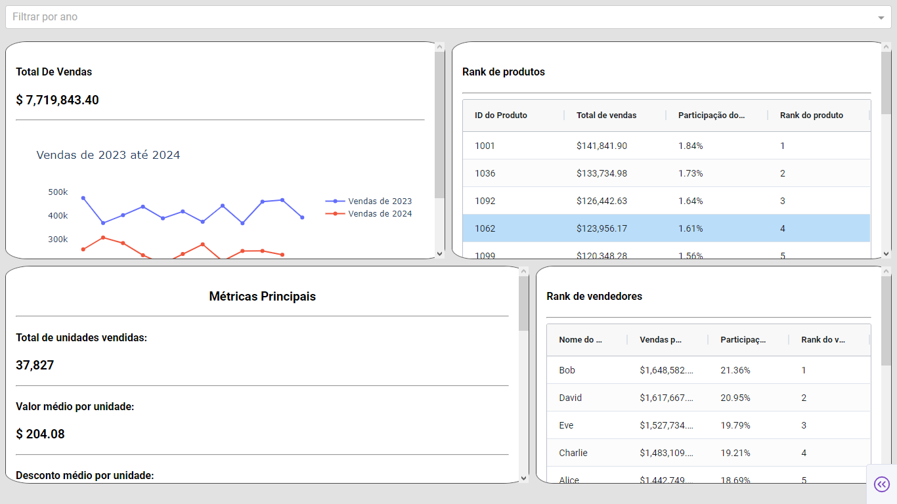
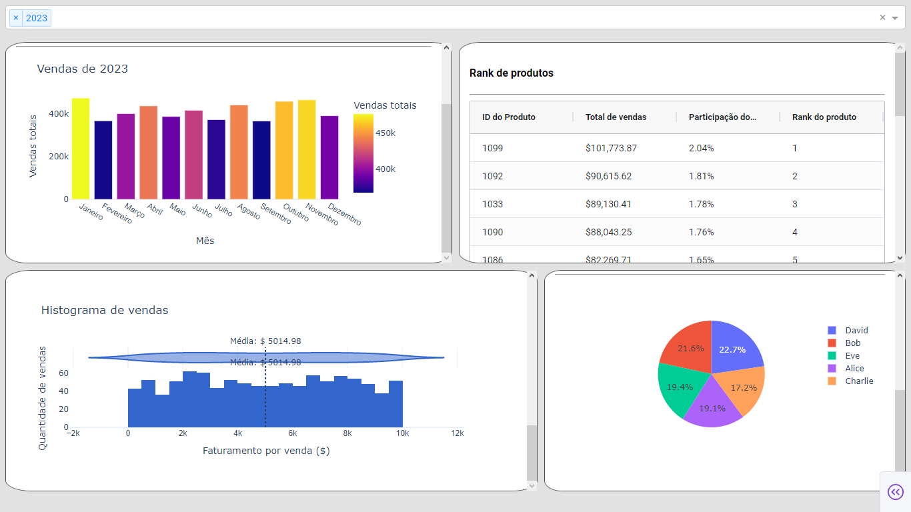

# 📊 Interactive Sales Dashboard with Dash

This project is a web-based interactive dashboard built with Dash (by Plotly), allowing users to visualize and explore sales data across different years. It combines dynamic visualizations, interactive tables, and intelligent filters to provide fast and clear insights into business performance.

---

## 🛠️ Tools & Libraries Used
- `pandas` – Data manipulation and analysis
- `plotly` – Data visualization
- `dash` – 	Web app and reactive callbacks
- `dash_ag_grid` – Advanced interactive tables

---

## Features
- ✅ Year filter with multi-select support
- 📈 Monthly sales chart (bar or line depending on year count)
- 💰 Total sales and performance metrics
- 🏆 Product ranking with sales share and position
- 👤 Sales representative ranking with interactive pie chart
- 🔍 Interactive tables powered by AG Grid (pagination, sorting, formatting)
- Histogram of the distribution of sales amounts per transaction.
- Simple metrics like average unit price, top payment method, and more

## Screenshot

