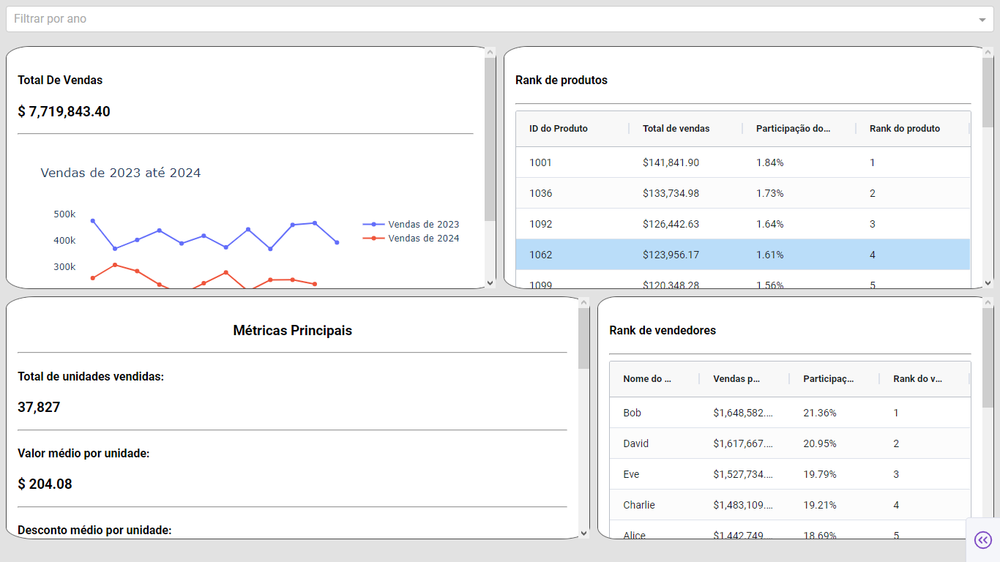
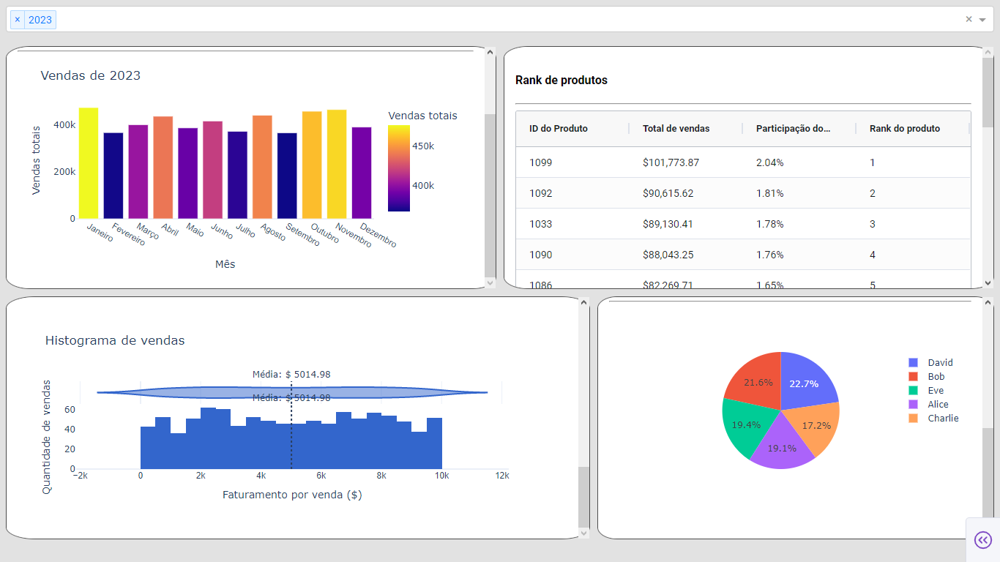

# 📊 Dashboard Interativo de Vendas com Dash

Este projeto é um dashboard web interativo desenvolvido com Dash que permite a visualização e análise de dados de vendas ao longo de diferentes anos. Ele combina visualizações ricas, tabelas dinâmicas, e filtros inteligentes para fornecer insights rápidos e claros sobre o desempenho da empresa.

---

## 🛠️ Tools & Libraries Used
- `pandas` – Manipulação e analise dedados
- `plotly` – Visualização de dados
- `dash` – 	Interface web e callbacks
- `dash_ag_grid` – Tabelas interativas avançadas

---

## Funcionalidades
- ✅ Filtro por ano com múltiplas seleções
- 📈 Gráfico de vendas por mês (barras ou linhas, dependendo da quantidade de anos selecionados)
- 💰 Total de vendas e métricas de desempenho
- 🏆 Ranking de produtos com participação e posição
- 👤 Ranking de vendedores com gráfico de pizza interativo
- 🔍 Tabela interativa com AG Grid (paginação, ordenação, formatação numérica)
- Histograma da distribuição do faturamento total por venda.
- Métricas simples como unidade média, desconto médio, canal principal, entre outros

---

## Screenshot

